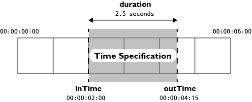

Time Specifications
===================

Summary
-------

A _time specification_ is an object that specifies a region of time within an arbitrary, longer period of time. They are typically used when defining video clips or segments in Aconite.

### Example

    {
        inTime: "00:00:02:00",
        outTime: "00:00:04:12",
        frameRate: 24
    }
_*Example 1*: A time specification for a 2.5-second clip at 24 fps._

Properties
----------

<table>
    <tr>
        <th>Name</th>
        <th>Description</th>
        <th>Type</th>
        <th>Optionality</th>
    </tr>
    <tr>
        <td><code>inTime</code></td>
        <td>The start time of the clip.</td>
        <td>A SMPTE time code <code>string</code> or a <code>Number</code> specifying the time in seconds.</td>
        <td>_required_</td>
    </tr>
    <tr>
        <td><code>outTime</code></td>
        <td>The end time of the clip.</td>
        <td>A SMPTE time code <code>string</code> or a <code>Number</code> specifying the time in seconds.</td>
        <td>_optional_. This property will take precedence over <code>duration</code> if both are specified.</td>
    </tr>
    <tr>
        <td><code>duration</code></td>
        <td>The duration of the clip.</td>
        <td>A SMPTE time code <code>string</code> or a <code>Number</code> specifying the duration in seconds.</td>
        <td>_optional_. This property will be ignored if <code>outTime</code> is also specified.</td>
    </tr>
    <tr>
        <td><code>frameRate</code></td>
        <td>The frame rate of the clip.</td>
        <td>A <code>Number</code> specifying the frame rate in which time codes should be intepreted.</td>
        <td>_optional_. Default: <code>30</code> fps.</td>
    </tr>
</table>

More Examples
-------------

    {
        inTime: 1, // Start at one second
        outTime: 5 // End four seconds later.
    }
_*Example 2*: A four-second clip specified with <code>inTime</code> and <code>outTime</code> as seconds._

    {
        inTime: "00:00:00:00",
        duration: 10.25 // seconds
    }
_*Example 3*: A time specification that uses a duration instead of <code>outTime</code>._
